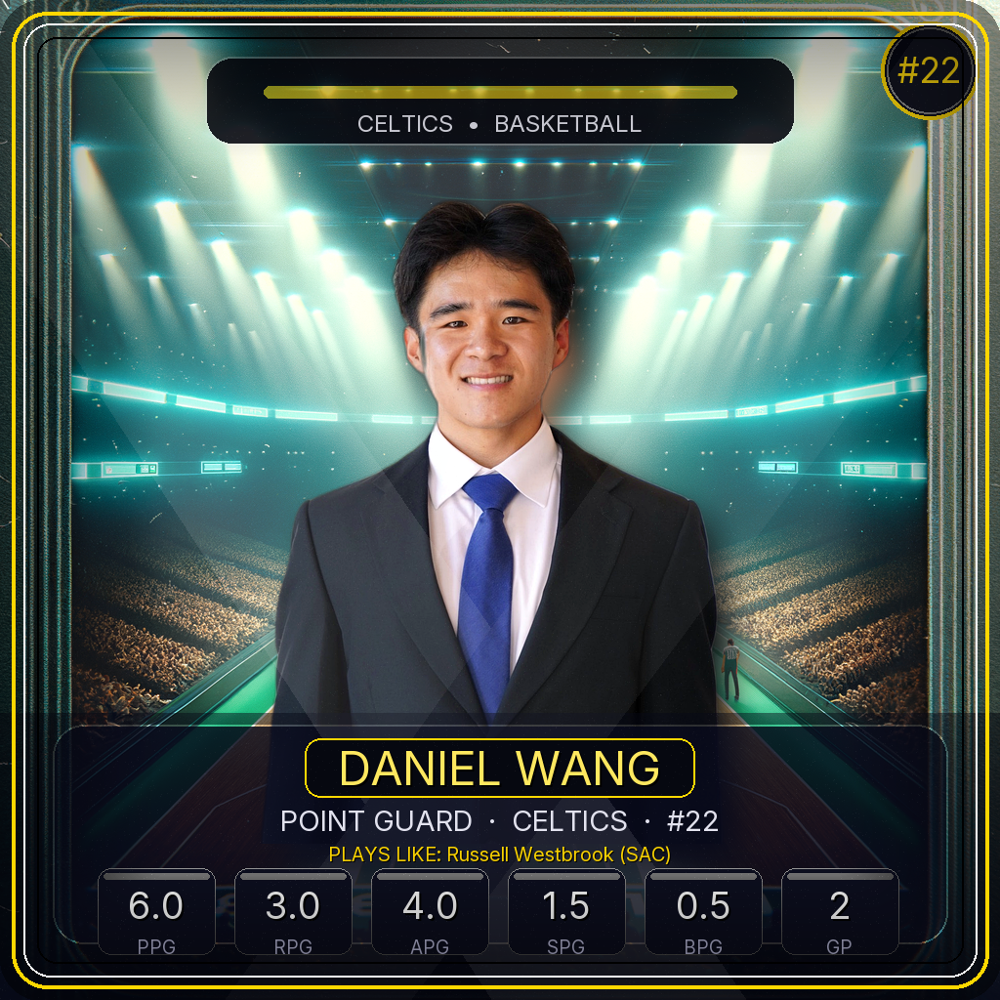

# AI Sports Stats Tracker & Trading Card Generator

An interactive full-stack-style sports analytics application built with Python and Streamlit that allows users to:

- Track and analyze basketball, football, and baseball statistics
- Compare performances to real professional athletes using similarity algorithms
- Generate AI-powered custom sports trading cards
- Create downloadable personalized player cards with dynamic stats and pro comparisons

---

# Try It Out

🔗 Live App: [Try the App Here](https://mystatstracker.streamlit.app/)

---

# Features

## Sports Stat Tracking

- Basketball stat tracking and analytics
- Football stat tracking and player comparison
- Baseball stat tracking
- Game logging and performance summaries

## Pro Player Comparison Engine

Uses weighted statistical similarity formulas to compare user performance against real professional athletes:

- NBA player comparisons
- NFL player comparisons
- Position-specific football comparisons

## AI Trading Card Generator

Generate custom AI-enhanced sports trading cards featuring:

- Personalized stats
- Player images with automatic background removal
- AI-generated stadium/card backgrounds using DALL·E 3
- Dynamic pro-player comparisons
- Team-inspired visual themes
- Downloadable high-resolution card output

---

# Sample Trading Card

---

# Tech Stack

## Frontend

- Streamlit

## Backend / Data

- Python
- Pandas
- SQLite

## APIs & AI

- OpenAI API (DALL·E 3)
- Anthropic API

## Computer Vision / Imaging

- Pillow (PIL)
- rembg
- onnxruntime

## Sports Data

- nba_api
- nflreadpy
- pybaseball

---

# How It Works

## Trading Card Pipeline

1. User uploads player image
2. Background is removed using rembg
3. DALL·E 3 generates a custom sports-card-style background
4. Player stats and pro comparisons are calculated
5. PIL composites the final trading card
6. User downloads the completed card

---

# Future Improvements

- User authentication
- Cloud database integration (Supabase/PostgreSQL)
- Persistent user accounts
- Mobile-friendly redesign
- Build out a coaches view
- Custom trading card rarity systems
